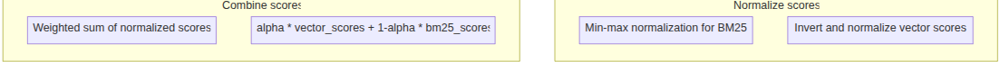
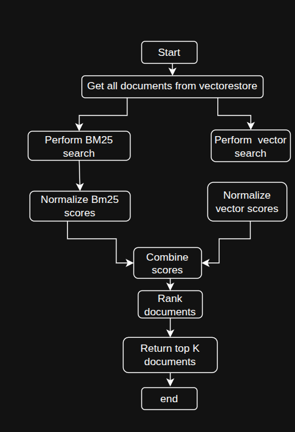

# Fusion retrieval
Fusion retrieval aims to combine these methods to create a more robust and accurate retrieval system that can handle a wider range of queries effectively.

Key Components:
1. PDF processing and text chunking
2. vectorstore create using FAISS and OpenAI EMbedding
3. BM25 index creation for keywork-based retrieval
4. Custom fusion retrieval function that combines both methods

# Multimodel retrieval
Implements one of the multiple ways of multi-modal RAG.
It extracts and processes text and images from PDFs,
utilizing a multi-modal Retrieval-Augmented Generation (RAG) system for
summarizing and retrieving content for question answering.

Key components:
PyMuPDF: For extracting text and images from PDF
Gemini 1.5-flash model: To summarize images and tables
Cohere Embedding: For embedding document splits
Chroma Vectorstore: To store and retrieve document embeddings
LangChain: To orchestrate the retrieval and generation pipeline.

# Reranking 
Reranking in RAG systems is to overcome limitations of initial retrieval methods, which often rely on simpler similarity metrics. 
Reranking allows for more sophisticated relevance assessment, 
taking into account nuanced relationships between queries and documents that might be missed by traditional retrieval techniques. 
This process aims to enhance the overall performance of RAG systems by ensuring that the most relevant information is used in the generation phase.

### Key Compenents:
1. Initial Retriever: often a vector store using embedding-based similary search
2. Reranking Model: This can be either:
    + A LLm for scoring relevance
    + A cross- encoder model specifically trained for relevance assessment
3. Scoring Mechanism: A method to assign relevance scores to documents
4. Sorting and Selection Logic: To reorder documents based on new scores

### Method Details:
The reranking process generally follows these steps:
1.Initial Retrieval: Fetch an initial set of potentially relevant documents.
2.Pair Creation: Form query-document pairs for each retrieved document
3.Scoring:
    +LLM Method: Use prompts to ask the LLM to rate document relevance.
    +Cross-Encoder Method: Feed query-document pairs directly into the model.
4.Score Interpretation: Parse and normalize the relevance scores.
5.Reordering: Sort documents based on their new relevance scores
6.Selection: Choose the top K documents from the reordered list.

# Hierachical retrieval
Implements a Hierarchical index system for document retrieval, utilizing two level for encoding: document level summaries and detail chunking.
This approach aim to improve the efficiency and relevance of information retrieval by the first identifying through summaries, 
then drilling down to specific details within those sections.

Tranditional flat indexing methods can struggle with large documents or corpus, protentially missing context or return irrelecavant information.
Hierarchical indexing addressing this by creating a two-tier search system, allowing for more effecient and context aware retrievel

### Key components

1. PDF processing and text chunking
2. Asynchronous document summarization using OpenAI's GPT-4
3. Vector store creation for both summaries and detailed chunks using FAISS and OpenAI embeddings
4. Custom hierarchical retrieval function

### Metod Detail:

1. The PDF is loaded and split into documents (likely by page).
2. Each document is summarized asynchronously using GPT-4.
3. The original documents are also split into smaller, detailed chunk
4. Two separate vector store and created:
    + One for document-level summararies
    + One for detaled chunk

# Dartboard Retrieval
The DartBoard RAG process addresses a common challenge in large knowledge base: ensuring the retrieved information in both relevant and no-relevant.
By explicitly optimizing a combined relevance-diversity scoring function, it prevents top-k documents from offering same information.

### Key components:
1. Relevance and diversoty combination:
    Computes a score factoring in both how pertinent a document is to the query and how distinci it is from already chosen documents.
2. Weighted belancing:
    Introduces RELEVENCE_WEIGHT and DIVERSITY_WEIGHT to allow the dymatic control of scoring
    Help in  avoidiong overly diverse but less relevance results
3. Production ready code:
    Derived from the official implementation yet reorganized for clarity.
    Allows easier integration into existing RAG pipelines.

### Method Details:
1. Document Retrieval
 +Obtain an initial set of candidate documents based on similarity (e.g., cosine or BM25).
 +Typically retrieves top-N candidates as a starting point.

2. Scoring and selection
    + Each documents overall score combines relevance and diversity:
    + Select the highest-scoring document, then penalize documents that are overly similar to it
    + Repeat until top-k documents are identified.
3. Hybrid / Fusion & Cross-Encoder Support
    + Essentially: distance between documet and query, and distance between documents
    - For Hybrid/Fusion: Merge similarities(dense and sparse/BM25) in to singe distance.
        Achievement by combine consin ombining cosine similarity over the dense and the sparse vectors (e.g. averaging them).   
        the move to distances is straightforward (1 - mean cosine similarity)
    - Cross-encoders directly use the cross-encoder similarity scores (1- similarity), potentially adjusting with scaling factors.

4. Balancing & Adjustment
    Tune DIVERSITY_WEIGHT and RELEVANCE_WEIGHT based on your needs and the density of your dataset
