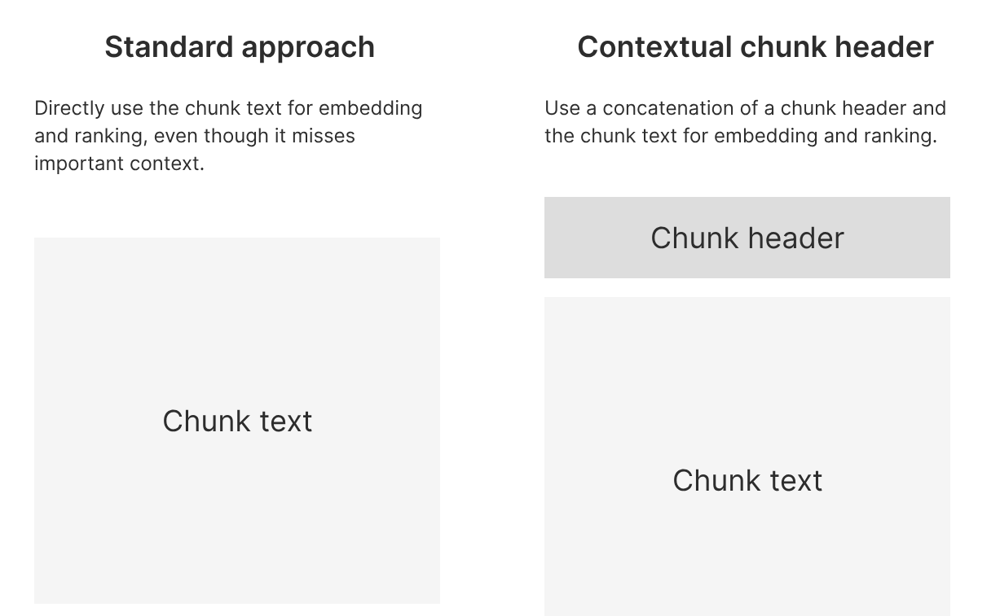
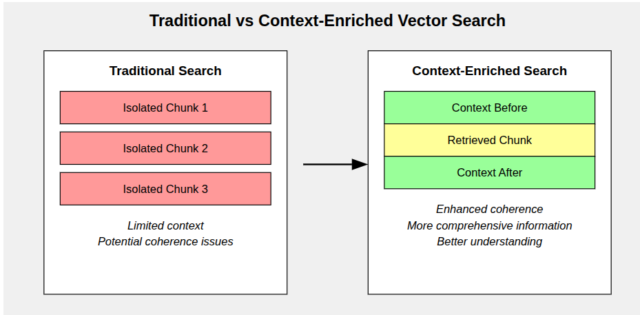
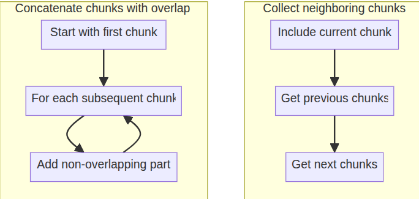
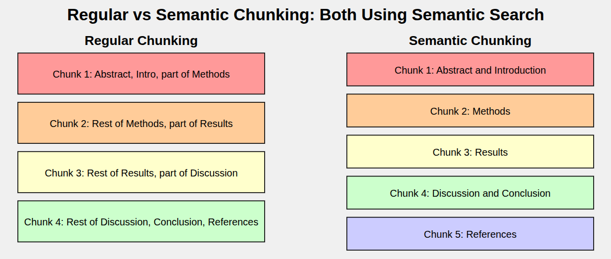
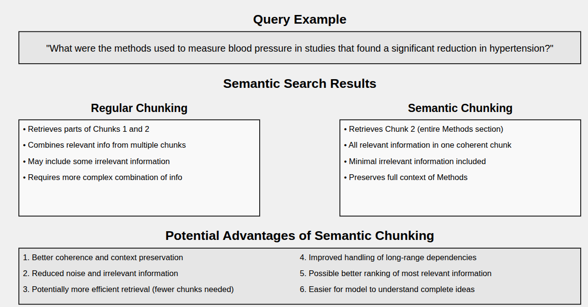

## Contextual Chunk Headers
Contextual Chunk Headers
Keys components
The idea here is to add header in hight level context to the chunk by prepending a chunk header
This chunk header could be as simple as the document title, or it could use a combination of document title,
concise document summary, ans the hierarchy of section  and sub-section titles




# Relevant Segment Extraction

Method detail:
Ducument chunking:
Standard documents chunking can be used. The only splecial requirement here is that document are chunk with no overlap. This allow us to reconstruct sections of
the document (eg segnent)by concatenating chunk.


RSE Optimization:
After standard chunk retriever process is  completed, which idea included a reranking step, the RSE can be beign.
1. Combine the absolute relevance value and the relevance rank.
2. we suctract a contant threshold value (let say 0.2) for each chunk'value
 By calculating chunk values this way we can define segment value as just the sum of the chunk values.


```text
Combine absolute relevance scores
          +
      relevant ranks
              │
              ▼
Subtract a constant threshold value
              │
              ▼
Find the maximum-sum subarray
              │
              ▼
Construct the full text segment by retrieving chunks from the chunk store
              │
              ▼
Repeat until no additional segment exceeds the minimum score threshold

                                                                                      
```

"""
# Context Window Enhancement
Context enrichment window for document retriever
Implement a context enrichment window technique for document retrieval in vector database.
Enchance the standard retrieval process by adding surrounding  context to each retrieved chunk


Motivation:
Traditional vector search often returns isolated chunks of text, which may lack necessary context for full understanding. 
This approach aims to provide a more comprehensive view of the retrieved information by including neighboring text chunks.


Key components:
1. PDF processing and text chunking
2. Vector store creation using FAISS and OpenAI embeddings
3. Custom retrieval function with context window
4. Comparison between standard and context-enriched retrieval



# Semantic Chunking
    Semantic chunking represents an advanced approach to document processing for retrieval systems. 
    By attempting to maintain semantic coherence within text segments, it has the potential to improve the quality of retrieved information and enhance the performance of downstream NLP tasks. 
    This technique is particularly valuable for processing long, complex documents where maintaining context is crucial, such as scientific papers, legal documents, or comprehensive reports.



# Contextual Compression

This code demonstrates the implementation of contextual compression in a document retrieval system using LangChain and OpenAI's language models. 
The technique aims to improve the relevance and conciseness of retrieved information by 
compressing and extracting the most pertinent parts of documents in the context of a given query.


1. Vector store creation from a PDF document
2. Base retriever setup
3. LLM-based contextual compressor
4. Contextual compression retriever
5. Question-answering chain integrating the compressed retriever