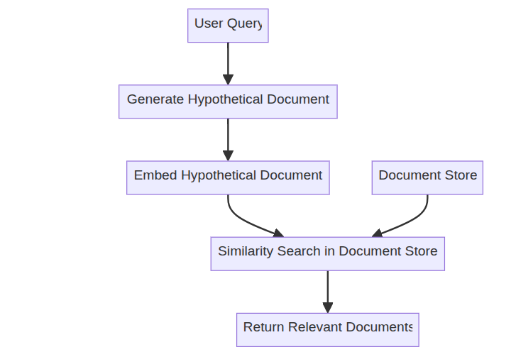
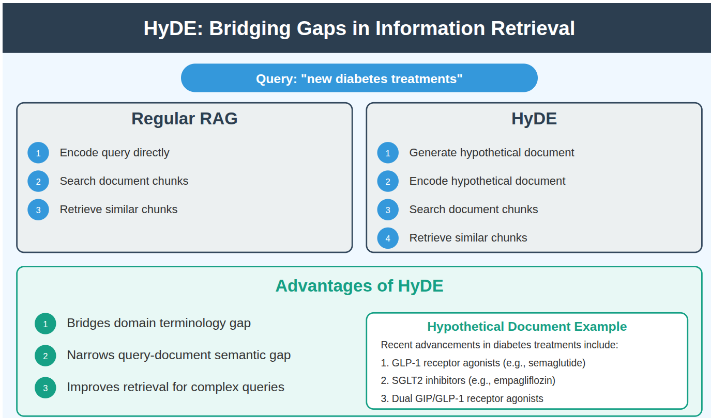
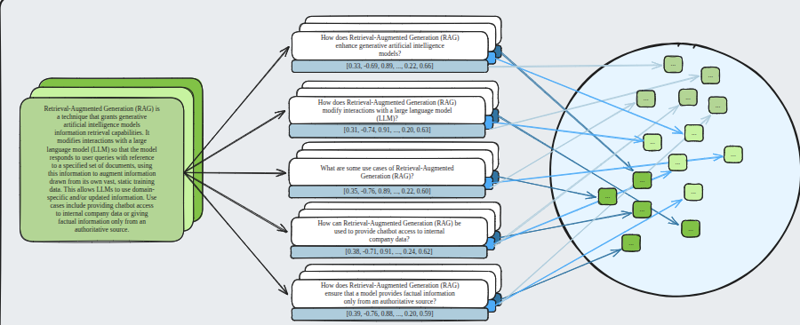

# 1. Query transformation
Implement three query transformation techniques in enhance the retriever process

1 query rewriting: Reformulates query to be more specific and detail -> improve likelihood to retrieving relevant information, use gpt 4 to write structure
2 step-back prompting: Genearate broader queries for better context retrieval -> more general queries can help retriever relevant  background information
3 sub-query decomposition: break down complexed queries into simple sub queries 

Query transformtion techniques addess retrieving the most relevant information by reformulation queres to match relevant document or to retrieve more 
comprehensive information

Example use case:

Query rewriting:  expand this specific aspects like temperature changes and biodiversity
step_back prompting:  generlizes it to : what are the general effect if climate change?
sub-query decomposition: break down it into question about biodiversity about  biodiversity, oceans, weather patterns and terrestial enviroments 

# 2. Hypothetical Document Embedding (HyDE)
Retrieval process:
the HyDERetriever process following steps:
1. Generate the hypothetical from user query using llm model.
2. Use the hypothetical document as the  search query in the vectorstore
3. Retriever most similar documents to this hypothetical document

# 3. Hypothetical Prompt Embeddings (HyPE)

1. PDF processing and text extraction
2. Text chunking to maintain coherent information units
3. Hypothetical prompt embedding generation using LLM to create multiple proxy questions per chunk
4. Vector store creation using FAISS and OPENAI embedding
5. Retriever up for query and process documents
6. Evaluation the RAG system

